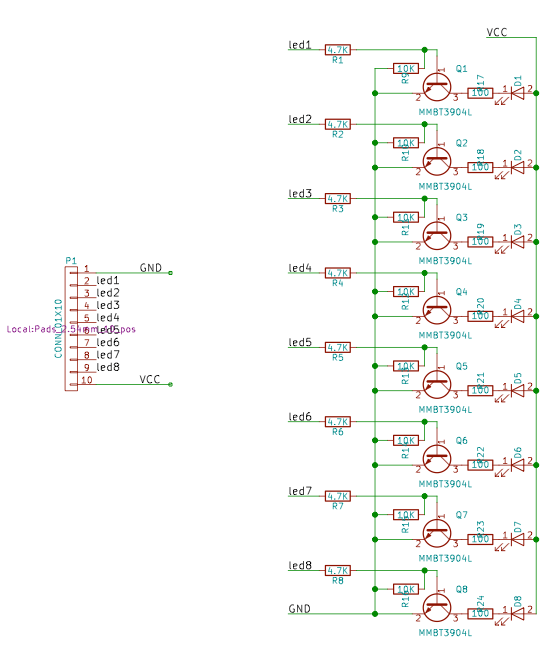
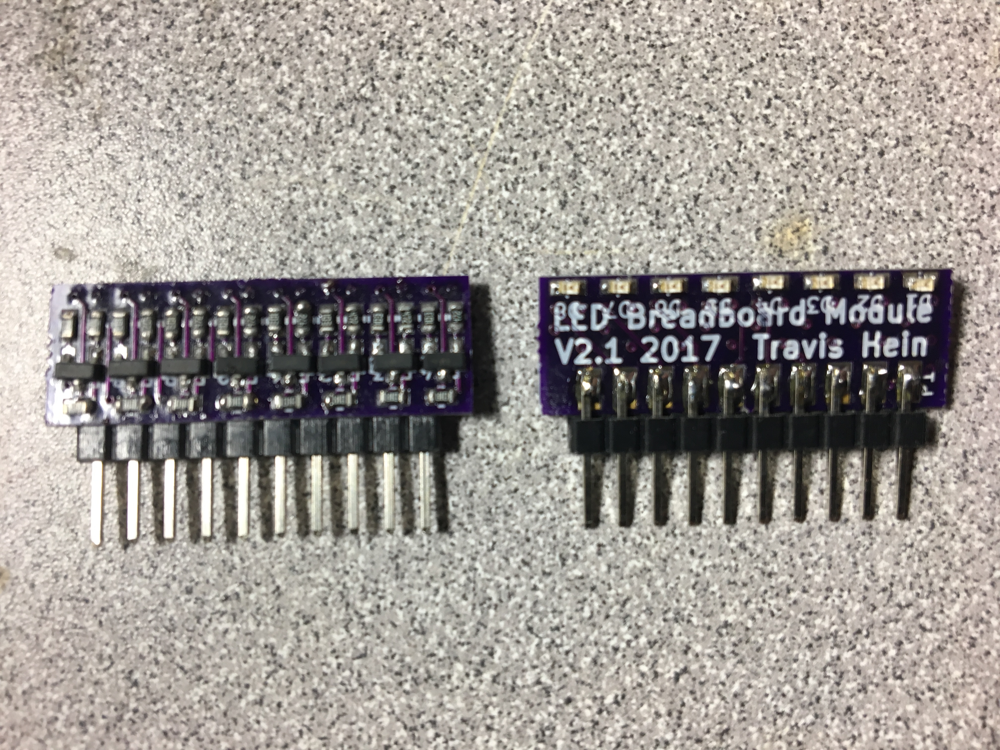

# A LED indicator module for breadboard development

I became frustrated at having to repeat the boring work of finding parts and assembling status LED circuits for breadboard development.

Most microcontroller projects need several LEDs. These have to be high impedance, to not load the data signals from the microcontroller. So you would want to set up a driver IC, or a transistor per LED. And then needing current limit resistors.

The whole effort is error prone and inconveniently takes up a lot of space on your breadboard.

So I set out to build a module that could be reused between projects. Just plug it in and go.

# Versions

As with any good effort, it can be improved upon.

## Version 1.0
This was a cordwood style construction, using perfboard. a 20 pin DIP socket, and 2x 74LS373 ICs. It supported two rows of 8 LEDs on the top. Where the LED and resistors were thru-hole style.

The 3 mm round LED had to be filed to rectangle shape to allow them to fit closer together. And the resistors were assembled creatively as one of the leads so was also the mechanical support for the LEDs

It was novel at the time because we were able to have 16 individual status LEDs in the footprint of a 20 pin DIP socket on a breadboard. This would have been around the early 2000's. I have pictures of these somewhere and should dig them up sometime.

## Version 2.0

Created spring 2017

Using surface mount components, place 8 LED, resistors, and transistor drivers.

Design a circuit board in Kicad, have it made at OSHPark.

A single 10 pin footprint.

Board dimensions 29mm (w) x 16mm (h)

It was not as many LEDs as the v1 model. But we could just use two modules for the same effect.

The 0603 package surface mount LEDs are very bright and easy to see.

The board works well with 3.5V as well as 5v.

Just use some small surface mount transistors and resistors.

In hindsight the pulldown resistors are unnecessary here.

## Version 2.1

Created late spring 2017

Lay out the same components as before, surface mount transistors, resistors, and LEDs.

Only use a 4 layer board so that components can be placed on both sides of the board.

This cut the board size down to 19mm (w) x 10mm (h)

I know it doesn't sound like much, but it just looks a lot better.

It is the same schematic as the v2 hardware.
