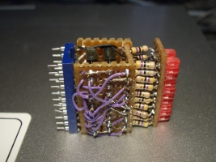
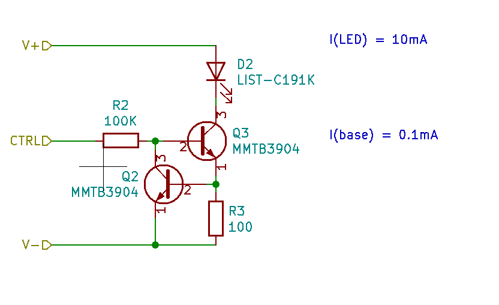

# A LED indicator module for breadboard development

I became frustrated at having to repeat the boring work of finding parts and assembling status LED circuits for breadboard development.

## The Problem

* Most microcontroller projects need several LEDs.
* These have to be high impedance, to not load the data signals from the microcontroller.
  > So you would want to set up a driver IC, or a transistor per LED. And then needing current limit resistors.

* The whole effort is error prone and inconveniently takes up a lot of space on your breadboard.

So I set out to build a module that could be reused between projects.

## Versions

As with any good effort, it can be improved upon.

### Version 1.0

At the time, I was a student of the University of Manitoba. I wanted something that was easy to plug into the lab breadboards, use for the duration of the lab, and then take it home with me.

This was a cordwood style construction, using perfboard. a 20 pin DIP socket, and 2x 74LS373 ICs. It supported two rows of 8 LEDs on the top. Where the LED and resistors were thru-hole style.

The 3 mm round LED had to be filed to rectangle shape to allow them to fit closer together. And the resistors were assembled creatively as one of the leads so was also the mechanical support for the LEDs

It was novel at the time because we were able to have 16 individual status LEDs in the footprint of a 20 pin DIP socket on a breadboard. This would have been around the early 2000's. I have pictures of these somewhere and should dig them up sometime.

### Version 2.0

Created spring 2017

Using surface mount components, place 8 LED, resistors, and transistor drivers.

Design a circuit board in Kicad, have it made at OSHPark.

* A single 10 pin footprint.

Board dimensions 29mm (w) x 16mm (h)

It was not as many LEDs as the v1 model. But we could just use two modules for the same effect.

The 0603 package surface mount LEDs are very bright and easy to see.

The board works well with 3.5V as well as 5v.

I found using a 74373 package this time to be limiting because

* it required 5V. I wanted something that was flexible to be used woth both 5V and 3.3V logic.
* The physical footprint of the soic device is not very convenient to place into this small planar footprint.

I opted to use some small surface mount transistors and resistors.

> In hindsight the pulldown resistors are unnecessary here.

### Version 2.1

Created late spring 2017

I was not happy with how tall the V2.0 module was.  At the time I built it I was still learning how to lay out PC boards with Kicad.

Here all I did was arrange the same components as before but t  use a 4 layer board.

This allowed me to pack the components densely onto both sides of the board.

This cut the board size down to 19mm (w) x 10mm (h)

I know it doesn't sound like much, but it just looks a lot better.

And it fits well onto breadboards. As a lower profile it is not in the way anymore as both the v1 and v2 iterations were sort of tall and would stick up enough to get knocked off the breadboard if you accidentally bumped it or wires got tugged across it.

### Version 3.0

Designed in Spring 2021

Taking what I have learned since designing version 2.1:

* There is no point in having a pulldown resistor on the base of the transistor. These are bipolar and do not need this pulldown like a MOSFET would.
* The LED and transistors get kind of hot when pushing more than 5v into them.
* The current through the LED is kind of high, about 20 mA each. We can use about 10 mA and get the same useful brightness.
* The base resistor is too. For the amount of gain in the transitor, we are sinking more current into the transistor than we need to.
* The lower base resistor causes the impedance of the amp to be lower, so some digital logic or IO ports become loaded more than what I had designed these self-buffering LED indicators to do for us.

Here measuring the currents on the breadboard. The LED is held around 10 mA over a wider range of input voltages. The larger input resistor keeps the drive current down to around 0.1mA. Though it could be less, I just don't have the ability to measure current this small.

Ordered some boards on OSH Park. Waiting for those to come in now.

