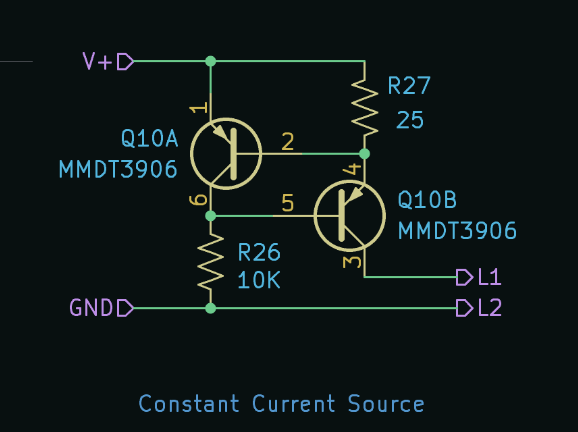
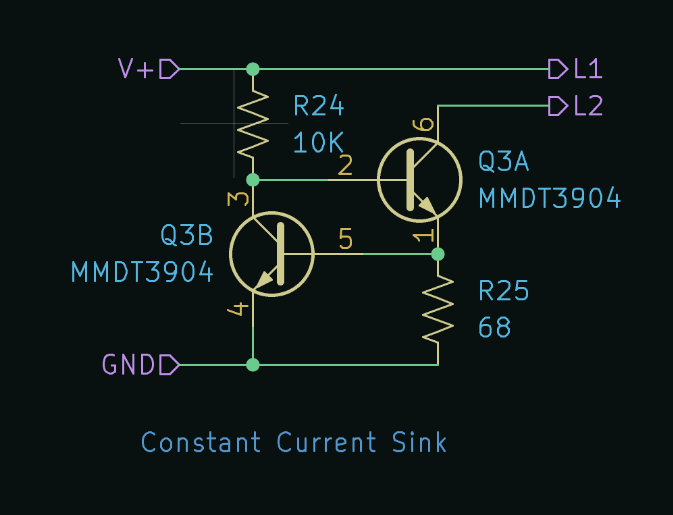
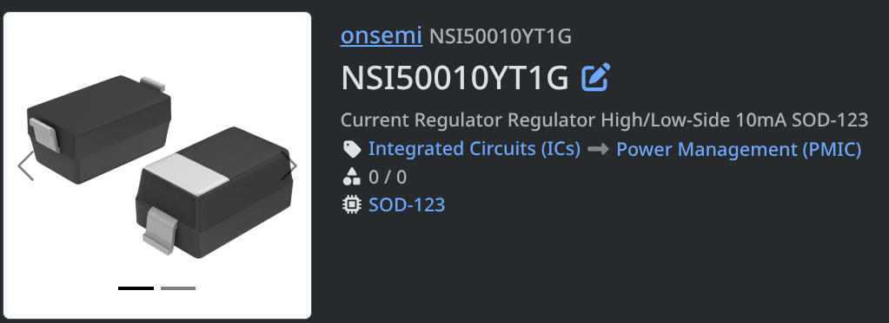
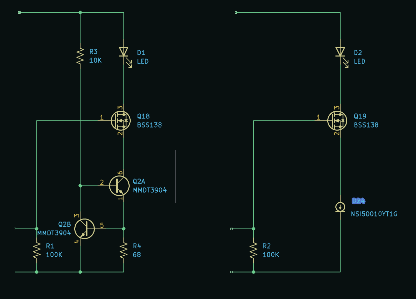
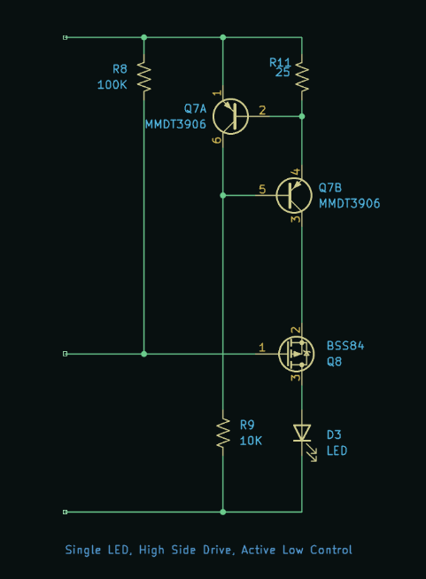
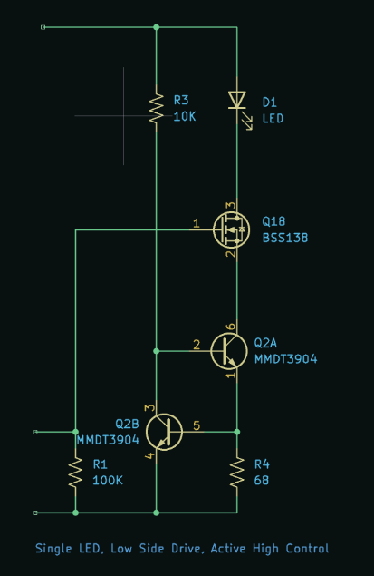
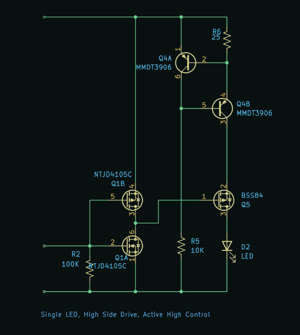
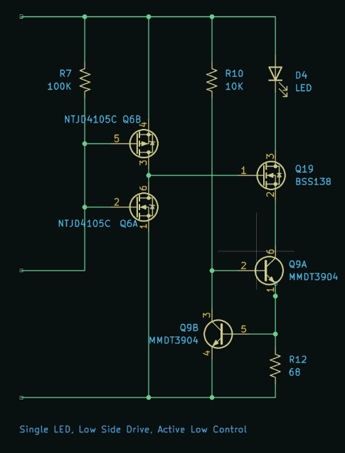

# Building Blocks

This was a side quest during v3 design to invesitagate different topologies

## Constant Current Source or Sink

In electronics, a constant current source or constant current sink is a specialized circuit that forces a precise, fixed amount of current through a load, regardless of changes in the load's resistance or variations in the supply voltage.

### A constant current source using BJTs

- Q10B: The primary pass transistor (PNP). It conducts the regulated current out of its collector (Pin 3) to the L1 output.
- R27 (\(25\ \Omega\)): The current-sensing resistor. It sits between \(V+\) and the emitter of Q10B, converting the output current into a small voltage drop.
- Q10A: The feedback control transistor (PNP). It monitors the voltage drop across R27 and throttles Q10B.
- R26 (\(10\text{ k}\Omega\)): The pull-down resistor that initially pulls the base of Q10B toward Ground to turn the circuit on.

When power (\(V+\)) is applied, current flows from \(V+\) through R27, past the emitter-base junction of Q10B, and down through R26 to Ground. This pulls Q10B's base low, turning it ON and sourcing current out of L1.

As the load current flowing out of L1 increases, the current passing through R27 increases, causing a voltage drop across it.

Because the emitter of Q10A is tied to \(V+\) and its base is tied to the other side of R27, the voltage drop across R27 is exactly the emitter-base voltage ($V_{EB}$) of Q10A. Once this voltage drop hits roughly \(0.65\text{ V}\), Q10A turns ON.

When Q10A turns on, it passes current from \(V+\) directly into the base of Q10B (Pin 5). This pushes Q10B's base voltage up toward \(V+\), starving its emitter-base drive and forcing Q10B to squeeze shut slightly.

This instantly limits the output current, keeping it perfectly flat even if the resistance of the load fluctuates.

## A constant current sink using BJTs

- Q3A: The primary pass transistor. It does the heavy lifting by pulling current from the load attached to L2.
- R25 (\(68\ \Omega\)): The current-sensing resistor. It converts the sinking current into a small voltage drop.
- Q3B: The feedback control transistor. It monitors the voltage across R25 and throttles Q3A to keep the current steady.
- R24 (\(10\text{ k}\Omega\)): The pull-up resistor that provides the initial turn-on current to the base of Q3A.

When power (\(V+\)) is applied, current flows through R24 into the base of Q3A (Pin 2). This turns Q3A ON, allowing current to flow from the load (L2) through Q3A and down through R25 to Ground.

As the load current increases, the voltage drop across R25 rises according to Ohm's Law (\(V = I \times R\)).

The top of R25 is connected directly to the base of Q3B (Pin 5). Once the current is high enough that the voltage drop across R25 hits roughly \(0.65\text{ V}\) (the threshold needed to turn on a silicon transistor), Q3B begins to turn ON.

As Q3B turns on, it begins to skim current away from the base of Q3A (Pin 2) and dumps it straight to Ground (Pin 4). This starves Q3A's base, forcing Q3A to turn off slightly and restrict the load current.

This negative feedback loop happens instantaneously, locking the current at a fixed, stable value regardless of variations in \(V+\) or the load's resistance.

## A constant current sink using a specialized device

It was a lot of fun and very educational to investigate using BJTs as constant current control.

But then I discovered that 'constant current regulation' is a thing.

This NSI50010YT1G is available on [DigiKey](https://www.digikey.ca/en/products/detail/onsemi/NSI50010YT1G/2271548) for $0.52 each, comes in a single SOD-123 package.

So clearly for less parts in the BOM for very slightly more cost. Since my priority is less stuff and smaller footprints, this is the winner.

We can see, for the low side drive, active high configuration, this simplifies the number of parts from 6 down to 4

Though it is not as 'fun' looking circuit.

## High Side Drive

This is when we have the switching part above the load.

In this case having a switch above the LED

A Use case for this type of circuit might be

- To drive common cathode 7-Segment displays
- When we want an active low input, without needing an inverter (if we were using a low-side drive)

## Low Side Drive

This is when we have the switching part below the load.

In this case having a switch below the LED

This has use cases for:

- a common anode 7-segment LED display
- the configuration of previous LED breadboard modules.

## Active High Control

This is when we want to use a logic level 1 to mean turn on the thing.

In this case using a logic level 1 to turn on a LED.

We have already shown this above for the low side drive.

If we want to have active high behavior for a high side drive we just add an inverter

## Active Low Control

This is when we want to use a logic level 0 to mean turn on the thing.

In this case using a logic level 0 to turn on a LED.

> This use case comes up a lot in our digital logic adventures. Most "output enable" or "chip select" pins are active low.
>
> Before I would need to place an inverter on the breadboard to flip the logic level to make the LED turn on for active low signals.

We have alrady seen the active low for high side drive above.

To realize an active low for low side drive we just add an inverter.

