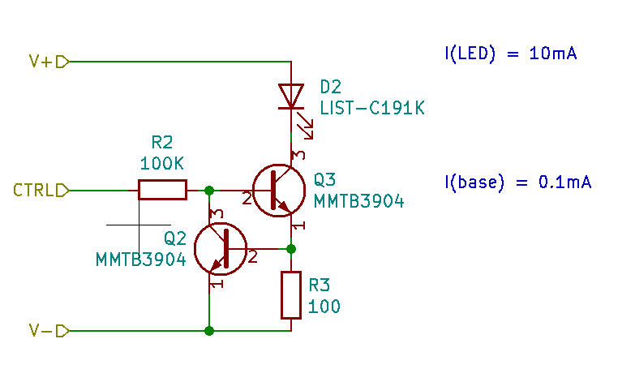
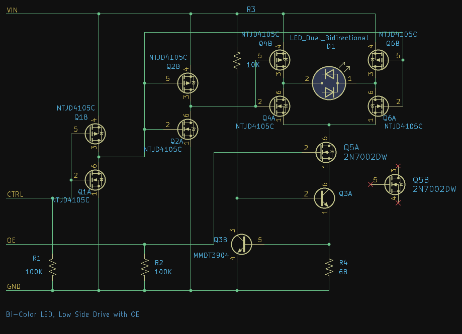
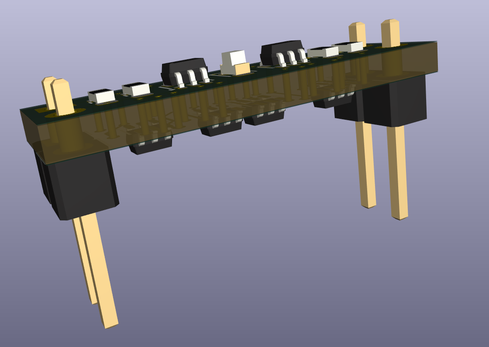

# Failed Attempts

> This is more of a log of the evolution and discovery during this build.

## V3 failed design

The original v3 module was designed in Spring 2021

The bottom transistor (Q2) with resistor (R3) works as a constant current source. As current across R3 increases, the voltage drop will also increase, turning on Q2 which will work to lower the base current going into Q3.

With R2 as a high value this will not load the input. The drive current is now around 0.1mA. Though it could be less, I just don't have the ability to measure current this small.

The gain of Q3 seems to provide around enough current to drive the LED over a wider range of input voltages.

2021: Ordered some boards on OSH Park. Waiting for those to come in now.

2026: Fast forward, somehow it is summer 2026. I have had the boards for years, moved. Everything was in storage. Dig out the parts. Trim mouse bites off boards. I can't remember now what distracted me from finishing these.

This time I investigated creating solder paste stencils using 3D printer and FreeCAD. But while waiting for solder paste to arrive from Amazon, lets try to assemble one LED circuit.

I discovered I made a mistake in KICAD, choosing the footprint for the 2N3904, which in the TO-92 case has pin 1 as emitter, pin 2 as base. Where here with the MMBT3904 in the SOT-23 package, pin 1 is the base.

My original schematic was incorrect: The base should be pin 1!

I also incorrectly had 100K resistor to drive the base, which is way too low current for practical use with 3.3v. I must have just tested it with 12v.

Okay, so we will need new boards. I am upsed that 2021 Travis did not notice this error. And I don't understand how I would have missed this, I had it correct in the V2 boards.

### A Red/Green LED Module with Output Enable

This is model G, or H (if we just reverse the LED) - Bi-color LED, control: 1=green, 0=red, with output enable

This borrows the same constant current sink and MOSFET input technology from the V3.1 red LED module.

We also take advantage of the using a double device package to get something in the SOT-363 packaging. Here we just not use the second device. This makes laying things out a lot easier.

This actually helps us a lot given we are trying to build all this stuff into a tiny PCB

The entire board is only 2 header pins wide and spance a bit more than a DIP package.

And then the realization that this LED is not a two package anti-parrel LED, but instead two separate LED, with 4 connectors. And they are wired in parallel diode orientation to boot. So even if I just soldered both pads on a side together I would just have two LEDs on at the same time with one direction and then none LEDs on with the other direction.

I kind of of did not see the point of building this module if it is just two LEDs.
