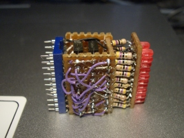

# LED Breadboard Module Version 1.0

This was made in 1999. At the time, I was a student of the University of Manitoba completing my undergrad degree in computer engineering.

We had electronics labs with wires and breadboards and discrete 74xx digital logic ICs. Our assignments were to wire up logic gates and simple sequential logic circuits. The inputs were toggle switches and the outputs were LEDs.

The lab was only a few hours long. Everytime we had to start from a blank breadboard, go collect parts, cut and strip wires, build the circuit, do the lab work, and then tear it all down and put everything away.

I noticed I would spend a lot of time, and a lot of breadboard realestate wiring up the output LEDs. As we progressed to creating 4 bit half adders and later working with 8 bits for a data bus, there was a lot of LEDs.

I liked to have LEDs on address bus too, not required for the lab work but it made things look pretty.,

I wanted something that was easy to plug into the lab breadboards,
use for the duration of the lab, and then take it home with me. Something that had the nuisance of resistors and a driver circuit that would not load the logic level outputs from the devices.

What I came up with was a small DIP socket sized module

This was a cordwood style construction, using perfboard and a 20 pin DIP socket.

The buffer here was 2x 74LS373 ICs. Each It supported two rows of 8 LEDs on the top. Where the LED
and resistors were thru-hole style. The extra LED were for showing the output enable and latch mode feature per row. Though these were not buffered. I think I wanted to be able to have the LEDs hold their state for some lab work...

The 3 mm round LED had to be filed to rectangle shape to
allow them to fit closer together. At the time I did not have rectangular LEDs.
And the resistors were assembled creatively
as one of the leads so was also the mechanical support for the LEDs

It was novel at the time because it enabled me to have 16 individual status LEDs in the footprint of a 20 pin DIP socket on a breadboard.

Showing up to do my labs was awesome. Plug in the module. Wire up the logic circuits, but not needing to spend a lot of time assembling the LED indicators and drivers and current limiting resistors.

The only downside here was if there was a desire to have status LEDs spread out over the entire breadbaord, like a chip enable beside the chip that is being enabled.

We now had all of the LEDs in one location and creating a diagram to map out the inventory of which one meant what function was essential.
