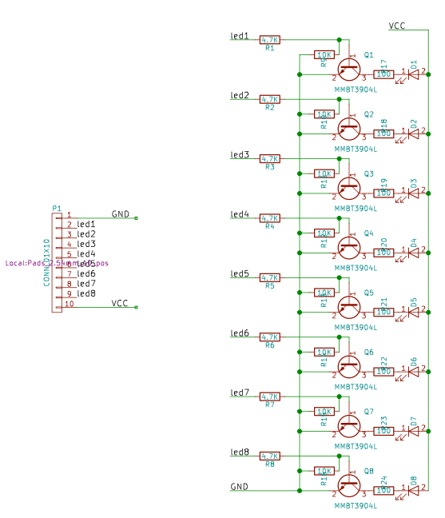
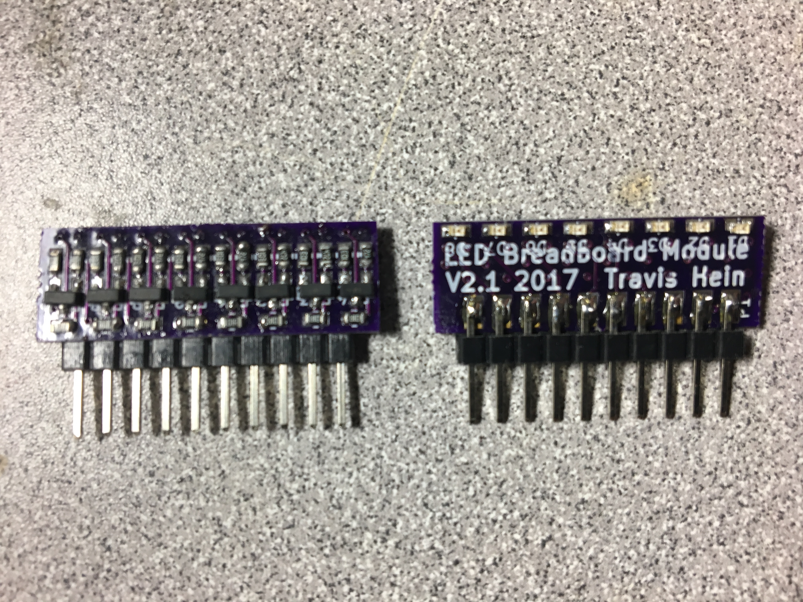

# LED Breadboard Module Version 2

Created spring 2017

Using surface mount components, place 8 LED, resistors, and transistor drivers.

Design a circuit board in Kicad, have it made at OSHPark.

* A single 10 pin footprint.

Board dimensions 29mm (w) x 16mm (h)

It was not as many LEDs as the v1 model. But we could just use two modules for the same effect. The footprint of this module was a single row, not a DIP format as well.

The 0603 package surface mount LEDs are very bright and easy to see.

The board works well with 3.5V as well as 5v.

I found using a 74373 package this time to be limiting because

* it required 5V. I wanted something that was flexible to be used woth both 5V and 3.3V logic.
* The physical footprint of the soic device is not very convenient to place into this small planar footprint.

I opted to use some small surface mount transistors and resistors.

> In hindsight the pulldown resistors are unnecessary here.

## Version 2.1

Created late spring 2017

I was not happy with how tall the V2.0 module was.
At the time I built it I was still learning how to lay out PC boards with Kicad.

Here all I did was arrange the same components as before but used a 4 layer board.

This allowed me to pack the components densely onto both sides of the board.

This cut the board size down to 19mm (w) x 10mm (h)

I know it doesn't sound like much, but it just looks a lot better.

And it fits well onto breadboards. As a lower profile it is not in the way anymore
as both the v1 and v2 iterations were sort of tall and would stick up enough
to get knocked off the breadboard if you accidentally bumped it or wires got tugged across it.

I no longer have latching or output enable features here as well. But for my current use cases this was not a significant problem.

Most of the time I was using a 74'595 serial in to parallel out shift register to drive these, and that would provide the latching feature for me.

Over time using it I found other use cases beyond the original use, for 5v and 3.3v microcontroller circuits.
But I discovered when driving more than 5v into this the LEDs and transistors get warm. This is beacuse they draw current proportional to voltage. This set me on the path to design the V3 module.
