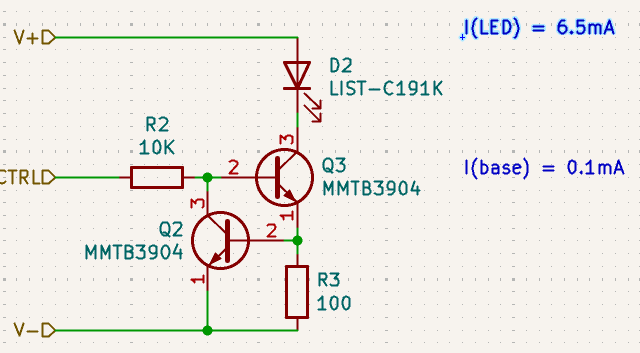
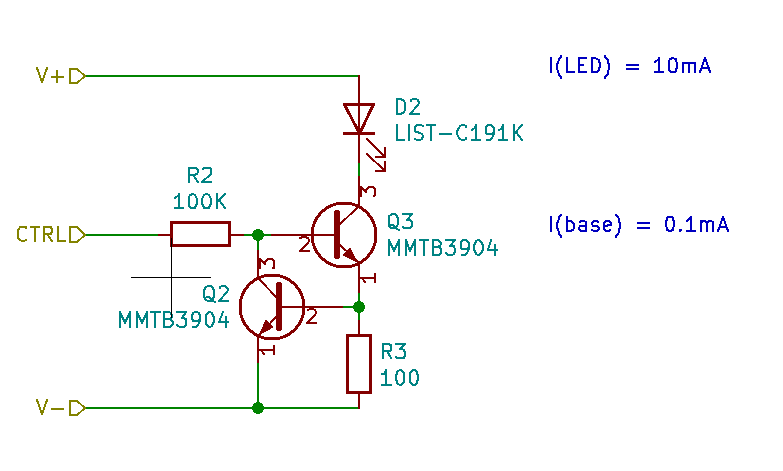

# LED Breadboard Module Version 3

Designed in Spring 2021

Taking what I have learned since designing version 2.1:

* There is no point in having a pulldown resistor on the base of the transistor. These are bipolar and do not need this pulldown like a MOSFET would.
* The LED and transistors get kind of hot when pushing more than 5v into them. This is beacuse the current is proportional to voltage.
* The current through the LED was kind of high, about 20 mA each. We can use much less, under about 10 mA and get the same useful brightness.
* The base resistor is too small. For the amount of gain in the transitor, we are sinking more current into the transistor.
  This causes a lower impedance and could load digital logic or IO ports more than what I had designed these self-buffering LED indicators to do for us.

The bottom transistor (Q2) with resistor (R3) works as a constant current source. As current across R3 increases, the voltage drop will also increase, turning on Q2 which will work to lower the base current going into Q3.

With R2 as a high value this will not load the input. The drive current is now around 0.1mA. Though it could be less, I just don't have the ability to measure current this small.

The gain of Q3 seems to proaround 10 mAvide enough current to drive the LED over a wider range of input voltages.

## Build Log

2021: Ordered some boards on OSH Park. Waiting for those to come in now.

2026: Fast forward, somehow it is summer 2026. I have had the boards for years, moved. Everything was in storage. Dig out the parts. Trim mouse bites off boards. I can't remember now what distracted me from finishing these.

This time I investigated creating solder paste stencils using 3D printer and FreeCAD. But while waiting for solder paste to arrive from Amazon, lets try to assemble one LED circuit.

I discovered I made a mistake in KICAD, choosing the footprint for the 2N3904, which in the TO-92 case has pin 1 as emitter, pin 2 as base. Where here with the MMBT3904 in the SOT-23 package, pin 1 is the base.

My original schematic was incorrect:

I also incorrectly had 100K resistor to drive the base, which is way too low current for practical use with 3.3v. I must have just tested it with 12v.

Okay, so we will need new boards. I am upsed that 2021 Travis did not notice this error. And I don't understand how I would have missed this, I had it correct in the V2 boards.

I will pause and rethink design and fight with KiCAD 10 to learn how to work with their design blocks.
