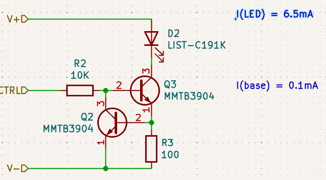

# LED Breadboard Module Version 3

Designed in Spring 2021

Taking what I have learned since designing version 2.1:

- There is no point in having a pulldown resistor on the base of the transistor. These are bipolar and do not need this pulldown like a MOSFET would.
- The LED and transistors get kind of hot when pushing more than 5v into them. This is beacuse the current is proportional to voltage.
- The current through the LED was kind of high, about 20 mA each. We can use much less, under about 10 mA and get the same useful brightness.
- The base resistor is too small. For the amount of gain in the transitor, we are sinking more current into the transistor.
  This causes a lower impedance and could load digital logic or IO ports more than what I had designed these self-buffering LED indicators to do for us.

The bottom transistor (Q2) with resistor (R3) works as a constant current source. As current across R3 increases, the voltage drop will also increase, turning on Q2 which will work to lower the base current going into Q3.

With R2 as a high value this will not load the input. The drive current is now around 0.1mA. Though it could be less, I just don't have the ability to measure current this small.

The gain of Q3 seems to proaround 10 mAvide enough current to drive the LED over a wider range of input voltages.

## Build Log

2021: Ordered some boards on OSH Park. Waiting for those to come in now.

2026: Fast forward, somehow it is summer 2026. I have had the boards for years, moved. Everything was in storage. Dig out the parts. Trim mouse bites off boards. I can't remember now what distracted me from finishing these.

This time I investigated creating solder paste stencils using 3D printer and FreeCAD. But while waiting for solder paste to arrive from Amazon, lets try to assemble one LED circuit.

I discovered I made a mistake in KICAD, choosing the footprint for the 2N3904, which in the TO-92 case has pin 1 as emitter, pin 2 as base. Where here with the MMBT3904 in the SOT-23 package, pin 1 is the base.

My original schematic was incorrect:

I also incorrectly had 100K resistor to drive the base, which is way too low current for practical use with 3.3v. I must have just tested it with 12v.

Okay, so we will need new boards. I am upsed that 2021 Travis did not notice this error. And I don't understand how I would have missed this, I had it correct in the V2 boards.

I will pause and rethink design and fight with KiCAD 10 to learn how to work with their design blocks.

## Revisit (2026)

My priority at this time

- Support a range of input voltages (so a constant current source for the LED)
- High impedance control inputs (to not load the signal we are monitoring)
- Option for an active low input to control the LED.
- Use an 0806 package for LED, larger, easier to see?
- A mode to allow a bi-color LED to be operated with a control signal and an output enable.

Variants

| Model | LED | Drive | Active High | Active Low | OE | Desc |
|----|-----|-------|:-----------:|:----------:|:-:|-----:|
|  A | Red | High  |  * | | | Single red LED, high side drive, active high control |
|  B | Red | High  |   | * | | Single red LED, high side drive, active low control |
|  C | Red | High  | * | * | | Single red LED, high side drive, both active high and active low control |
|  D | Red | Low   | *  |  | | Single red LED, low side drive, active high control |
|  E | Red | Low   |  | * | | Single red led, low side drive, active low control |
|  F | Red | Low   | *  | * | | Single red led, low side drive, both active high and active low control |
|  G | Red/ Green | H Bridge | * | | * | Bi-color LED, control: 1=green, 0=red, with output enable |
|  H | Red/ Green | H Bridge |  | * | * | Bi-color LED, control: 0=green, 1=red, with output enable |

So model "A" is the only one I have had before, since v2 anyway. I am interested in building Model "A" and Mode "G: at this time. We wil get around to the others as needed.

While iterating with these designs I discovered there are packages that have two transistors in a single package. These exist in all permutations

- *Bipolar Transistors*

BJTs are current-controlled devices. You must pay attention to how much current flows into the base to control the larger current flowing through the collector.

| Transistor 1 | Transistor 2 | Part Number | Package | Vceo | Ic | hFE | Vce(sat) | Vbe(on) |
|-|-|-|-|-|-|-|-|-|
| NPN | (none) | MMBT3904 | SOT23-3 |  40 V | 200 mA | 100-300 (at 10mA) | 0.2V (at 10mA)  0.3V (at 50mA) | 0.65V-0.85V |
| NPN | NPN    | MMDT3904 | SOT-363 |  40 V | 200 mA | 100-300 (at 10mA) | 0.2V (at 10mA)  0.3V (at 50mA) | 0.65V-0.85V |
| PNP | (none) | MMBT3906 | SOT23-3 | -40 V | -200 mA | 100-300 (at -10mA) | -0.3V (at 50mA) | -0.65V - -0.85V |
| PNP | PNP    | DMMT3906 | SOT-363 | -40 V | -200 mA | 100-300 (at -10mA) | -0.3V (at 50mA) | -0.65V - -0.85V |
| NPN | PNP    | BC846    | SOT-363 |  65V | 100mA | 110-800 (by suffix group) | 0.25 (at 10mA)   0.6V (at 100mA) | 0.58V - 0.77V |

- Vceo (Collector-Emitter Voltage): The absolute maximum voltage the transistor can withstand between the collector and emitter when the base is open. Your circuit voltage should ideally be 20–50% below this rating for safety.
- Ic (Continuous Collector Current): The maximum continuous current the transistor can handle. For standard switching, ensure your load demands significantly less than this limit.
- hFE or β (DC Current Gain): The ratio of collector current to base current (Ic / Ib). Crucial Note: This value drops drastically when the transistor is fully saturated (turned hard ON as a switch). Always look at the datasheet curves, not just the maximum value.
- Vce(sat) (Collector-Emitter Saturation Voltage): The voltage drop across the transistor when it is fully turned ON. Multiplying this by your Ic gives you the conduction power loss (P = Vce(sat) x Ic), which tells you how hot it will get.
-Vbe(on) (Base-Emitter On Voltage): The voltage required across the base and emitter to start turning the transistor on (typically around 0.6V to 0.7V for silicon).

- *MOSFET Transistors*

MOSFETs are voltage-controlled devices. They require almost zero continuous current at the gate, making them highly efficient for high-speed switching and power applications.\(V_{DSS}\)

| Transistor 1 | Transistor 2 | Part Number | Package | Vdss | Id | Vgs(th) | Rds(on) | Qg |
|-|-|-|-|-|-|-|-|-|
| NMOS | (none) | BSS123LT1G | SOT23-3 | 100 V | 170 mA | 2.6 V | 6.0 Ω (at Vgs = 10V) | 0.68 nC |
| NMOS | NMOS   | 2N7002DW | SOT-363 | 60 V | 115 mA | 2.0 V| 7.5 Ω (at Vgs = 5V) | 0.35 nC |
| PMOS | (none) | BSS84LT1G | SOT23-3 | -50 V | -130 mA | -2.0 V | 10.0 Ω (at Vgs = -5V) | 0.60 nC |
| PMOS | PMOS   | BSS84AKS | SOT-363 | -50 V | -160 mA | -2.1 V | 7.5 Ω (at Vgs = -5V) | 0.35 nC |
| NMOS | PMOS   | NTJD4105CT1G | SOT363 | N: 20 V   P: -8 V |  P: -8 VN: 630 mA   P: -775 mA | N: 1.5 V    P: -1.5 V | N: 0.375 Ω (at 4.5V)   P: 0.260 Ω (at -4.5V) | N: 0.62 nC   P: 0.82 nC |

- Vdss (Drain-Source Voltage): The maximum voltage the MOSFET can block between the drain and source when turned off.
- Id (Continuous Drain Current): The maximum current the device can handle. Note that this is heavily dependent on temperature and proper heat sinking.
- Vgs(th) (Gate-Source Threshold Voltage): The voltage at which the MOSFET just barely begins to conduct. Warning: Do not use this as your driving voltage. A threshold of 2V means it is barely passing microamps.
- Rds(on) (Static Drain-Source On-Resistance): The internal resistance when the MOSFET is fully turned ON. This determines your power loss (P = Id^2 * Rds(on)). Lower resistance means less heat. Crucial: Always check what Vgs voltage was used to achieve that Rds(on) rating. If the datasheet specifies Rds(on) at VgsGS = 10V, it will run incredibly hot or fail if you try to drive it with a 3.3V microcontroller.
- Qg (Total Gate Charge): The amount of electrical charge needed to fully turn the gate on and off. Because the gate acts like a capacitor, a high Qg requires a strong gate-driver circuit to switch quickly without overheating.

### Single LED, Low Side Drive, Active High Control

Another discovery during this round of design was realizing how much smaller a SOT-363 package is from a SOT23-3.  It was enough that it made more sense to just make every device be in the SOT-363 package and not even use SOT23-3 packages.
We just had the (1) BSS123 in our circuit. So it was straight forward to replace it with the 2N7002DW.
This then made sense to share the second device with another LED channel. Since we are building 8 channels in one module here this helps to reduce the parts count.

This configuration uses the constant current sink we started with before from the (failed) v3.0 design with a mosfet control. This changes it from a current controlled device to a voltage controlled device. So this should not load signal that we attach
the LED to other than the gate capacitance.

The module is about the same size as the v2.1 build, but there is a bit more going on. At the same time less packages. Its complicated.

Front:

Back:

### A Red/Green LED Module with Output Enable

This is model G, or H (if we just reverse the LED) - Bi-color LED, control: 1=green, 0=red, with output enable

This borrows the same constant current sink and MOSFET input technology from the V3.1 red LED module.

We also take advantage of the using a double device package to get something in the SOT-363 packaging. Here we just not use the second device. This makes laying things out a lot easier.

This actually helps us a lot given we are trying to build all this stuff into a tiny PCB

The entire board is only 2 header pins wide and spance a bit more than a DIP package.
