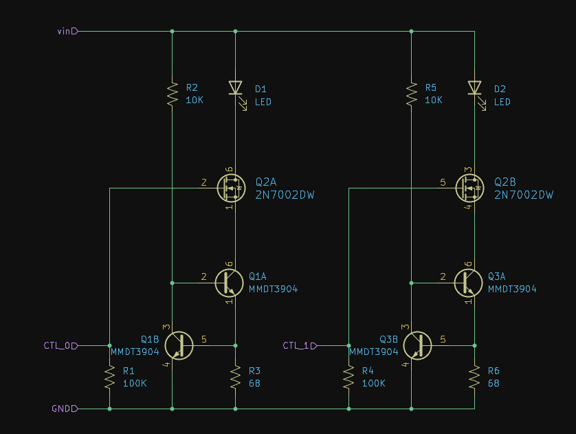
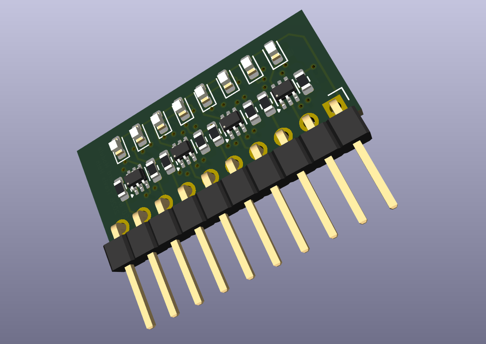
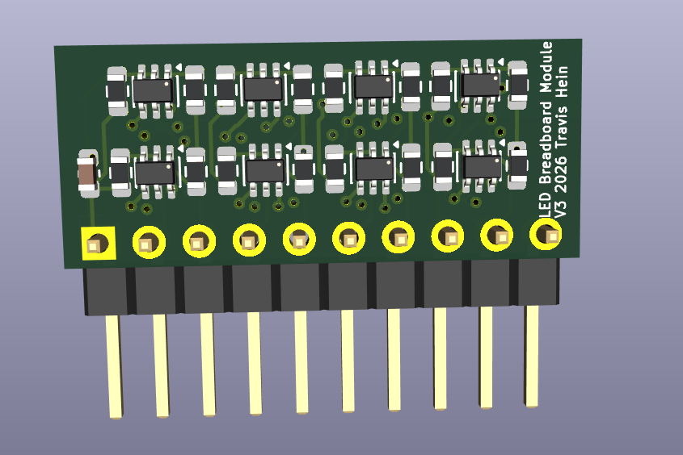
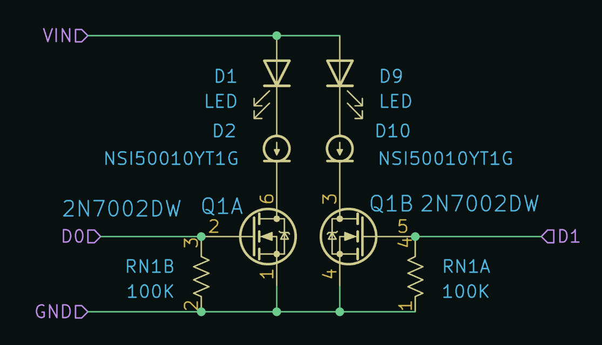
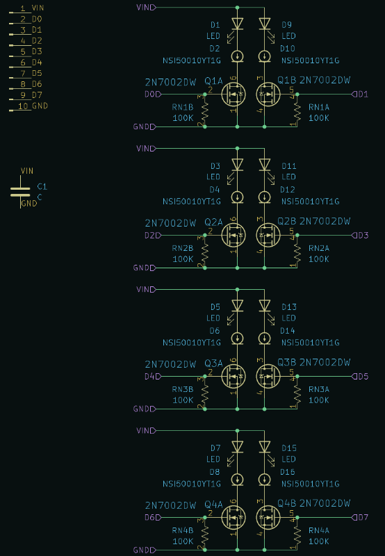
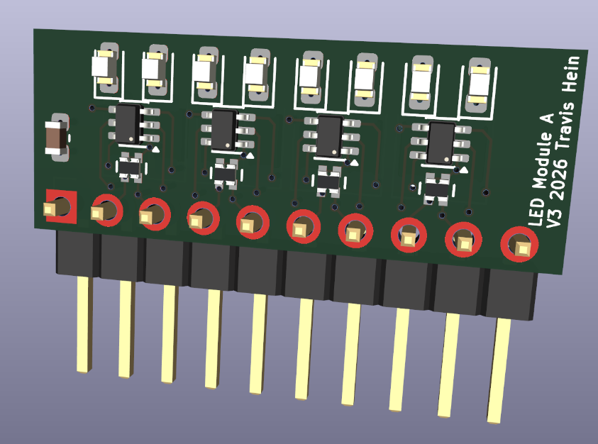
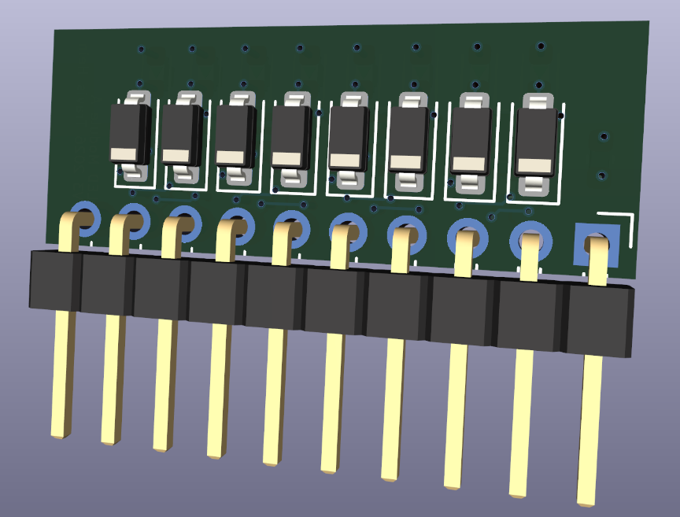

# LED Breadboard Module Version 3

Taking what I have learned from the v2.1 design:

- There is no point in having a pulldown resistor on the base of the transistor. These are bipolar and do not need this pulldown like a MOSFET would.
- The LED and transistors get kind of hot when pushing more than 5v into them. This is beacuse the current is proportional to voltage and I just had a simple current limiting resitor for the LED.
- The current through the LED was kind of high, about 20 mA each. We can use much less, under about 10 mA and get the same useful brightness.
- The base resistor is too small. For the amount of gain in the transitor, we are sinking more current into the transistor.
  This causes a lower impedance and could load digital logic or IO ports more than what I had designed these self-buffering LED indicators to do for us.

## Design Constraints

I have learned to state what it is I want to achieve up front so this is my road map.

My priority at this time

- Support a range of input voltages (so a constant current source for the LED)
- High impedance control inputs (to not load the signal we are monitoring)
- Option for an active low input to control the LED.
- Use an 0806 package for LED, larger, easier to see?
  - no. more investigation shows larger packages do not make a brighter LED.
- A mode to allow a bi-color LED to be operated with a control signal and an output enable.
  - This turned out to be pointless.
  At the time I had this point I was thinking there would be a device with true anti-parallel wiring, two LEDs with two wires on the package.
  In practice the LEDs I have found with more than one color just have multiple input pins.
- Support for standard logic IC families - to create a breadboard module for a 74HC595 (a serial in, parallel out shift register), that functions as the 74HC595 should, but with lights for the outputs. And in general other popular ICs, like discrete logic gates.
  I was imagining a TSSOP package IC with the drivers so the footprint is a slightly larger DIP kind of package with the same pin out of the device.
- Investigate a modyke where A single LED can be dropped into breadboard.
  A three terminal device that has two pins to go into the breadboard power rails and a pin that can go into the row that presumably has an IC pin.
  So we can just drop an indicator for a single pin of an existing IC
- A 'universal LED'. A Two terminal device that looks like a 3mm or 5mm thru hole LED. It accepts power, any polarity and a range of voltage. It just lights up. Simple indicator, like a regular old light bulb, but its a LED.

## Learning and Theory

I did a side quest to investigate and learn about different topologies:

- high side drive
- low side drive
- constant current source
- constant current sink

The notes are in the [building blocks](building_blocks.md) document.

While iterating with these designs I discovered there are devices that have two transistors in a single package. The use case being for multiple LED on a module we could benefit from using a dual device in a single package. My notes and discovery are in the [transistor theory](transistor_theory.md) document.

Another discovery during this round of design was realizing how much smaller a SOT-363 package is from a SOT23-3. It was enough that it made more sense to just make every device be in the SOT-363 package and not even use SOT23-3 packages.

The next discovery was there exists a product that provides constant current regulation in a single package. I no longer need to build out my own discrete components. Four parts become one part.

And then the realization, I still need pull down resistors for the MOSFET transistors, But instead of individual resistors I can use a resistor network. Single package in a 1206 footprint with 8 100K resistors.

## Variants

Since some of the constraints and use cases are contradictory, I decided I would just define a model (uncreatively using letters) to articulate each variant.

Weather or not we actually get around to designing and building these has yet to be seen.

| Model | # LEDs | Color | Drive | Active High | Active Low |  OE   |                                            Desc |
| ----- | ------ | ----- | ----- | :---------: | :--------: | :---: | ----------------------------------------------: |
| A     | 8      | Red   | High  |      *      |            |       | 8 red LED, high side drive, active high control |

So model "A" is the only one I have had before with v2 design.

Future considerations

| Model | LED | Drive | Active High | Active Low | OE | Desc |
|----|-----|-------|:-----------:|:----------:|:-:|-----:|
|  C | Red | High  | * | * | | Single red LED, high side drive, both active high and active low control |
|  D | Red | Low   | *  |  | | Single red LED, low side drive, active high control |
|  E | Red | Low   |  | * | | Single red led, low side drive, active low control |
|  F | Red | Low   | *  | * | | Single red led, low side drive, both active high and active low control |

### Model A

We just had the (1) BSS123 in our circuit. So it was straight forward to replace it with the 2N7002DW to get a SOT-363 package.

This then made sense to share the second device with another LED channel. Since we are building 8 channels in one module here this helps to reduce the parts count.

This was designed with the transistor constant current sink we started with before we discovered the single package constant current regulator device

I had laid it out as module about the same size as the v2.1 build. .

Front:

Back:

But since I did not build this, instead went ahead with the single package current regulator approach.

The current regulators in to replace the pair of BJTs. Four devices down to one.

Again using the two devices in a single package for the MOSFETs.

New this iteration: using resistor networks. I first tried a single package with 8 resistors, but it was a mess to route. Here we have two resistors in one package. Which gives us half as many packages for the pull down resistors.

And then scale out to get 8 LEDs.

Front:

Back:

Way less parts!

> I noticed this time the LED are vertical instead of horizontal like they were on V2.
> I think i prefer this as it providers closer grouping visually, to indicate the 8 bits easier.
